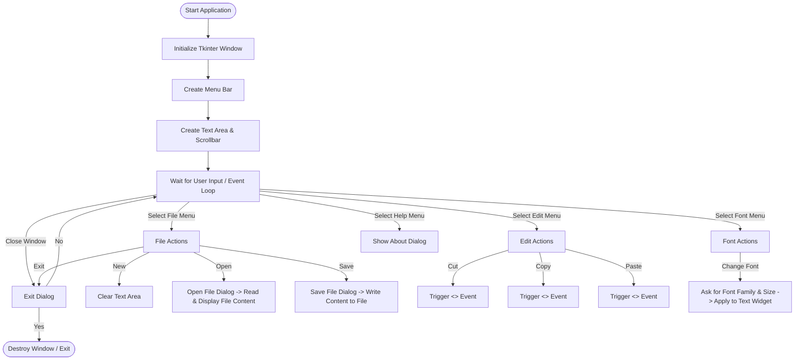

# Text Editor in Python (Tkinter)

A lightweight, cross-platform graphical text editor built using Python's standard GUI library, **Tkinter**. This project contains two versions of the text editor, ranging from a simpler version (`c.py`) to an enhanced version with font customizability and scrollbars (`text_editor.py`).

---

## 🚀 Features

### Core Features (Both Versions)
- **New File**: Clear the editor to start writing a new document.
- **Open File**: Open existing text (`.txt`) files directly into the editor.
- **Save File**: Save your work to a local text file.
- **Clipboard Operations**: Cut, copy, and paste text using built-in OS-level clipboard events.
- **Exit Dialog**: Confirmation prompt to prevent accidental closure of the application.

### Enhanced Features (in `text_editor.py`)
- **Custom Fonts**: Dynamically change the font family (e.g., Arial, Courier, Helvetica) and font size.
- **Custom Scrollbar**: Seamlessly scroll through larger text documents using a dedicated scrollbar widget.

---

## 🛠️ Technology Stack

- **Language**: Python 3.x
- **GUI Framework**: Tkinter (Python's built-in standard GUI package)
- **Modules Used**:
  - `tkinter` (main GUI module)
  - `tkinter.filedialog` (file open and save dialogs)
  - `tkinter.messagebox` (about details, error messages, and quit confirmations)
  - `tkinter.simpledialog` (user input for custom fonts)
  - `tkinter.font` (handling text font modifications)

---

## 📁 Project Structure

```bash
Text-Editor/
│
├── text_editor.py       # Enhanced version with scrollbar and font changing options (Recommended)
├── c.py                 # Simplified/Standard version of the text editor
├── .gitignore           # Ignores temporary Python cache and editor configuration files
└── README.md            # Project documentation and guide
```

---

## ⚙️ How to Setup & Run

### Prerequisites
Make sure you have **Python 3** installed on your system. Tkinter comes pre-installed with most Python distributions. 

If you are on Linux, you might need to install Tkinter manually using:
```bash
sudo apt-get install python3-tk
```

### Execution Commands

To run the enhanced version of the text editor:
```bash
python text_editor.py
```

To run the simpler version:
```bash
python c.py
```

---

## 🔄 Working & Execution Flow

When you start the application, it initializes the main window, builds the menu configurations, packs the text component, and starts the event listener loop.

### Flowchart



### Detailed Component Flow
1. **Startup**: The application launches, instantiating `tk.Tk()`. The title is set to "Text Editor" with a default geometry of 800x600 pixels.
2. **Menu Creation**: The menu bar cascade items (File, Edit, Font, Help) are populated and mapped to their respective Python callback functions.
3. **User Interaction**:
   - Clicking **New** triggers `new_file()`, which deletes characters from line 1, column 0 (`1.0`) to the end (`tk.END`).
   - Clicking **Open** triggers `open_file()`, prompting a file selector and loading file contents.
   - Clicking **Save** triggers `save_file()`, writing the editor's text content to a specified path.
   - Clicking **Change Font** opens dialog prompts requesting a Font Family name and Font Size number, dynamically applying them to the editor.
4. **Graceful Exit**: The window intercept protocol `WM_DELETE_WINDOW` calls `on_exit()`, prompting the user with a confirmation box before shutting down the GUI thread.
